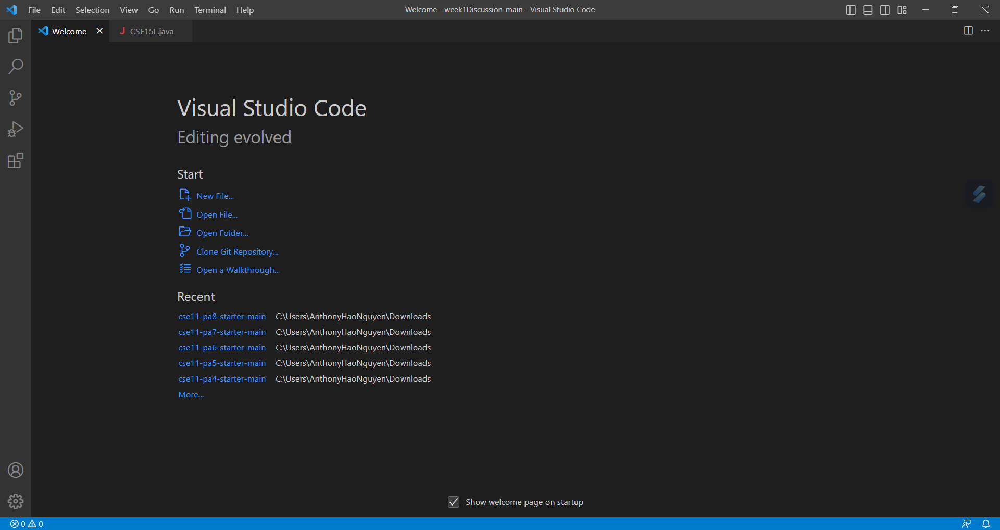
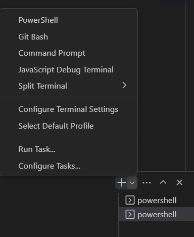
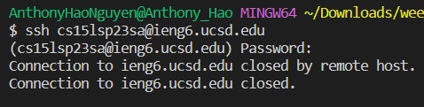
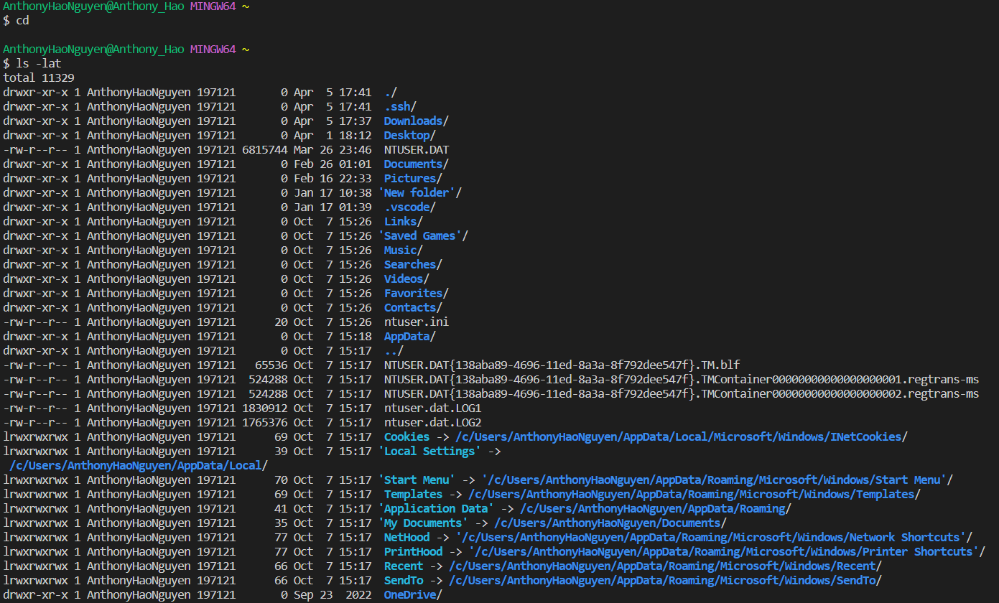

# Lab Report 1
## 1. Install VScode
To install VScode you would first need to open a brower and search VScode. Click on the first link and follow the steps to download. Finally run VScode. It should look something like this: 

## 2. Remotely Connecting
First you need to open a new terminal in your VScode. Then open Git Bash. 
 
Next type in the code: "ssh cs15lsp23zz@ieng6.ucsd.edu" but replace "zz" with the letters in your account from [Account Lookup](https://sdacs.ucsd.edu/~icc/index.php). Then enter your password and you should get a message. 

## 3. Trying Some Commands
Finally write some commands in your terminal. You can try codes like: cd, cd ~, ls -lat, and ls -a.

